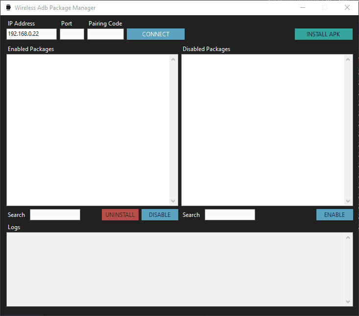

# Wireless Adb Package Manager
This tool is a GUI for adb specifically to assist in Wireless ADB pairing/connecting and installing or enabling/disabling installed applications on android devices.

## Usage
1) Enable Developer Options
2) Enable Wireless Adb via Developer Options
3) Go to Pair New Device
4) Enter the IP address, Port, and Pairing Code and hit Connect
5) Once pairing complete you will be taken back to the initial Wireless Adb screen
6) Enter the port number it shows beside your IP on the device and hit Connect
7) Install, Disable, or Enable apps as needed
 
## Additional Notes
This tool was designed with Samsung Galaxy Watches and other WearOS devices in mind to facilitate sideloading apks and disabling bloatware.